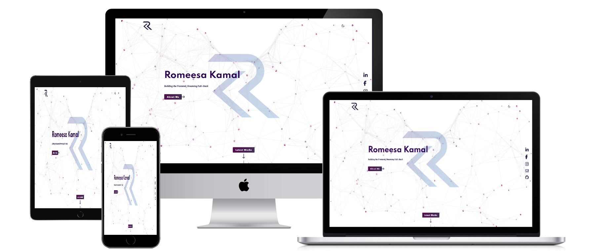
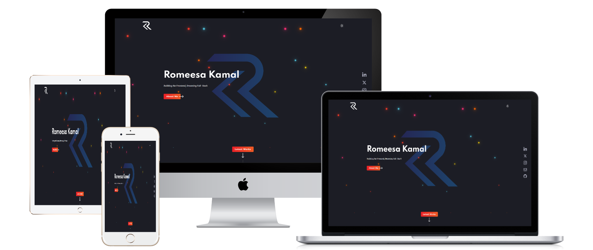

# My Web Development Portfolio

Welcome to my portfolio! This repository showcases the projects I've worked on as I develop my skills as a web developer. It features a range of applications and designs, highlighting my ability to work with modern technologies and frameworks.

## Screenshots

## Features

- Responsive and visually appealing design built with Tailwind CSS.

- A collection of projects demonstrating my proficiency with various tools and technologies.

- Easy-to-navigate sections for projects, skills, and contact information.

## Technologies Used

- **Frontend:** JavaScript, Tailwind CSS

- **Build Tools:** Vite

- **Hosting:** GitHub Pages

## How to Run Locally

### Getting Started

To get a local copy up and running follow these simple steps.

Prerequisites
VIsual Studio Code.
A Web Browser (preferably Brave)

### Setup

Clone the GitHub Repository

- git clone " https://github.com/RomeesaKamal/RK-professional-portfolio.git"

### Usage

Start your server by clicking Go Live

### Links

- Solution URL: [solution URL here](https://github.com/RomeesaKamal/RK-professional-portfolio)
- Live Site URL: [live site URL here](https://romeesakamal.github.io/RK-professional-portfolio/)

1. Clone this repository:

# Build With

## 🌎 Live Demo:

- [Live Demo Link](https://romeesakamal.github.io/RK-professional-portfolio/)

## Author

### 👤 **Romeesa Kamal**

- GitHub: [@kamalromeesa](https://github.com/RomeesaKamal/)
- Fronted Mentor: [@Romeesakamal](https://www.frontendmentor.io/profile/RomeesaKamal)
- Linkedin: [@Romeesakamal](https://www.linkedin.com/in/romeesa-kamal-7864b8342/)

## 🤝 Contributing

Contributions, issues, and feature requests are welcome!

Feel free to check the issues page.

## Show your support

Give a ⭐️ if you like this project!

## Acknowledgments

- Thanks to the [Mujeeb ur Rehman](https://github.com/Mujeeb4582/) for the great curriculum.
- Thanks to the Code Reviewer(s) for the insightful feedback.

## Why this is special:

- This portfolio is a showcase of my journey as a web developer, featuring projects that demonstrate my technical skills and creativity.

- Built with a focus on responsiveness and clean design, it highlights my ability to craft user-friendly interfaces.

- Each project reflects my expertise in modern technologies like  Tailwind CSS, and API integration.

- The portfolio serves as a dynamic platform, continually updated as I grow and learn in the tech space.

- Explore my work, discover my passion for coding, and feel free to reach out for collaborations or inquiries!

## 📝 License

This project is MIT licensed.

_NOTE: we recommend using the [MIT license](https://choosealicense.com/licenses/mit/) - you can set it up quickly by [using templates available on GitHub](https://docs.github.com/en/communities/setting-up-your-project-for-healthy-contributions/adding-a-license-to-a-repository). You can also use [any other license](https://choosealicense.com/licenses/) if you wish._